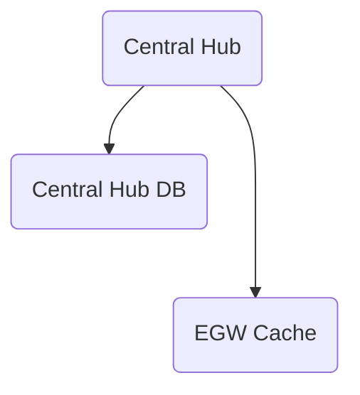

# Cache Strategy

Date: 05/03/2024

## Status

Approved

## Context

In our proposal, we will not store patient data permanent in the [EGW Systems](../Solution/EdgeGatewaylSystem.md)  as we do not want to expose too much data 
outside the Central Hub.

But as we want to display Patient relevant data in the Monitoring system per Nurse Station, 
we decided to use a non-permanent in-memory patient store.
 

## Decision

Each EGW System will notify the Central Hub when its available and the Central Hub 
will push data changes in a Cache-Write-Through manner into the connected EGW Systems where the data should be sent to. 

## Consequences

*Positives*

- Each Nurse Station only knows about the patients which are associate to it 
- Setups are decentralized and can work independently
- Data is always fresh in th e EGW 

*Negatives*

- Requires a Cache-Write-Through process per Nurse Station
- additional synchronisation overhead  

---
[> Home](../README.md)    [> Architecture Decision Records](README.md)
[< Prev](10-SystemHardware.md)  |  [Next >](12-Database.md)