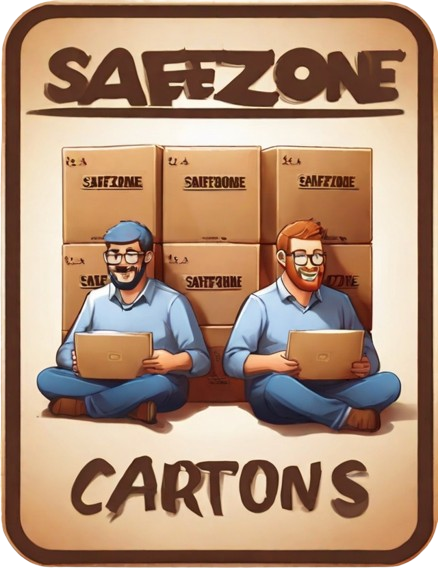

# Architectural Kata Spring 2024 - Safezone Cartons

Welcome to our entry to the O'Reilly Winter 2024 Architectural Kata.  
The aim of this documentation repository is to communicate our design for the problem described, for a stakeholder and development team audience.

## Members

- Thomas Goik (Team Lead)
- Maik Stockmann
- Jakob Bennemann

## Solution Structure
[Clarifications](Clarifications.md)

[Glossary](Glossary.md)

[Problem Background](Problem/README.md)

- [Business Goals, Drivers](Problem/BusinessGoalsDrivers.md)
- [Requirements](Problem/Requirements.md)
- [Data Calculations](Problem/DataCalculation.md)
- [Stakeholder Concerns](Problem/StakeholderConcerns.md)
- [Architecture Analysis](Problem/ArchitectureAnalysis.md)
- [Actors, Actions & Significant Scenarios](Problem/ActorsActions.md)
- [Constraints & Assumptions](Problem/ConstraintsAndAssumptions.md)

[Solution Background](Solution/README.md)

- [Diagram Technique](Solution/DiagramTechnique.md) 
- [Overall Architecture Style Analysis](Solution/ArchitecturePattern.md) 
- [Conceptual System Design](Solution/Conceptual.md) 
    - [Overall System](Solution/OverallSystem.md) 
    - [Edge Gateway System](Solution/EdgeGatewaylSystem.md)
    - [Edge Gateway Container](Solution/EdgeGatewayContainer.md)
- [Data Store Processing](Solution/DataStore.md) 
- [Provisioning](Solution/Provisioning.md) 
- [System Deployment](Solution/Deployment.md) 
- [Hardware](Solution/HardwareConnectivity.md) 
- [QR Device](Solution/QRDeviceRegistryFlow.md) 
- [ADRs](ADRs/README.md)
- [Ideas Visuals](ViewsAndPerspectives/README.md)

## Resources 

- [2024 Architecture Katas Presentation](assets/docs/2024-spring-kick-off.pdf)
- [Project Miro Board](https://miro.com/app/board/uXjVNuLaflw=/?share_link_id=105993346647)
- [Video Presentation](assets/video/Safezone-Cartons-Presentation-720p.mp4) 
---

*Logo generated by leonardo.ai*