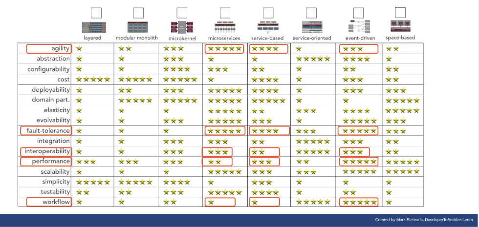

[> Home](../README.md)    [> Solution Background](README.md)
[< Prev](ArchitecturePrinciples.md)  |  [Next >](Conceptual.md)

---

# Overall Architecture Style Analysis

## Identified Key Architectural Characteristics

The [key architectural characteristics](../Problem/ArchitectureAnalysis.md) that were identified help us to select and overall architecture style.  
Our 3 most important characteristics are shown in **bold**.

- **Performance (2)**
- Scalability
- **Availability (1)**
- Security
- Workflow
- **Agility (3)**
- Interoperability

## Architecture Capabilities Comparison

Based on our identified characteristics

[original comparison matrix from [DeveloperToArchitect.com](https://www.developertoarchitect.com/downloads/worksheets.html)]

## Architecture Capabilities Analysis

The above matrix gives us three candidates for our architecture, which we can consider further:

### Microservices

| Pros                                                                                                        | Cons                                                                                                                                             |
|-------------------------------------------------------------------------------------------------------------|--------------------------------------------------------------------------------------------------------------------------------------------------|
| Scores highly on elasticity and scalability, very important for analytics computation and media access.     | Scores low on performance and workflow, which would be a big trade-off with performance being one of the top 3 characteristics.                  |
| Scores highly on fault-tolerance, important to make sure MonitorMe is not disrupted by a fault in one area. | Scores low on costs and simplicity. Not one of our main concerns, but as we've a on-premise setup this should be considered as well.             |
|                                                                                                             | Requires that the database be split along with each microservice. This would be very complex and another big trade-off.                          |
|                                                                                                             | Scores low on workflow, which would be a trade-off with workflow being important for onboarding of customers.                                    |

### Event-Driven

| Pros                                                                                                      | Cons                                                                                                                              |
|-----------------------------------------------------------------------------------------------------------|-----------------------------------------------------------------------------------------------------------------------------------|
| Scores highly on elasticity and scalability, very important for analytics computation and media access.   | Interoperability and configurability score fairly low, which is a concern with them being two of the top three characteristics.   |
| Scores highly on fault-tolerance, important to make sure MonitorMe is not disrupted by a fault in one area.| Not one of our main concerns, but as we've a on-premise setup this should be considered as well.                                  |
| Workflow scores highly, important for sending almost real-time notifications.                             |                                                                                                                                   |                                                                                                                                         |

### Service-Based

| Pros                                                                                                        | Cons                                                                                                                                          |
|-------------------------------------------------------------------------------------------------------------|-----------------------------------------------------------------------------------------------------------------------------------------------|
| Scores highly on agility, very important for adapting to changing industry and learnings                    | Scores low on workflow, which would be a trade-off with workflow being important for onboarding of customers.                                 |
| Scores highly on fault-tolerance, important to make sure MonitorMe is not disrupted by a fault in one area. | Scores fairly low on performance and low on workflow, which would be a big trade-off with performance being one of the top 3 characteristics. |

## Conclusion

All three architecture options have trade-offs and none fits our requirements perfectly.  
In the end the benefit of having a combination of Event-Driven and Service-Based architecture fits our requirements best.

### Decision

ADR: [07 Architecture Decision](../ADRs/07-ArchitectureDecision.md)

---
[> Home](../README.md)    [> Solution](README.md)
[< Prev](DiagramTechnique.md)  |  [Next >](Conceptual.md)