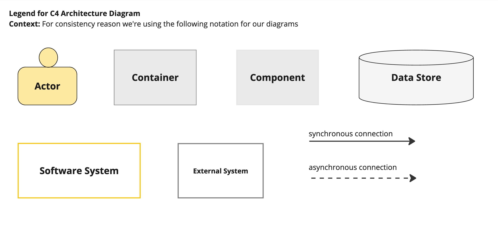
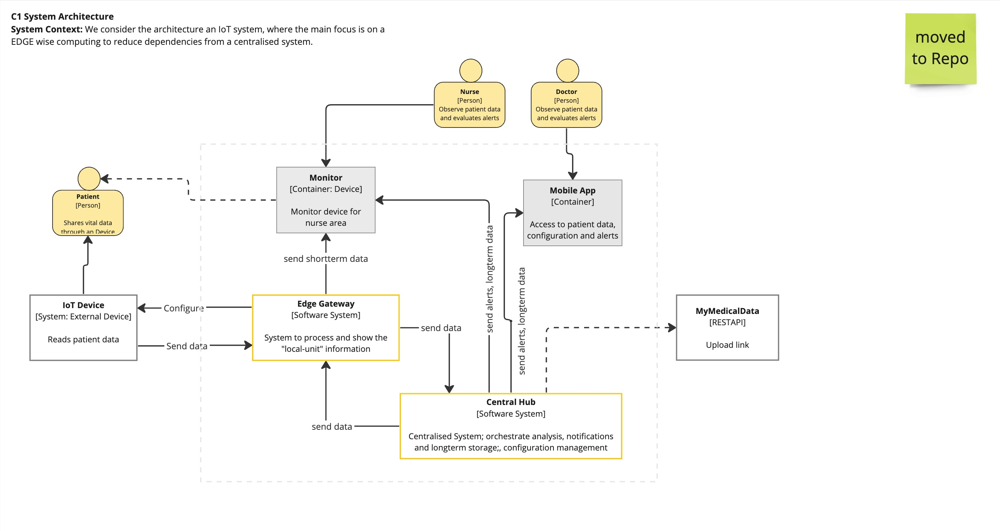
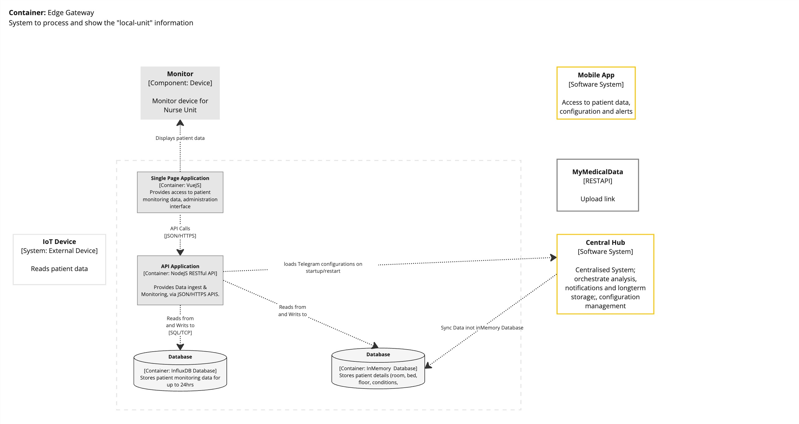
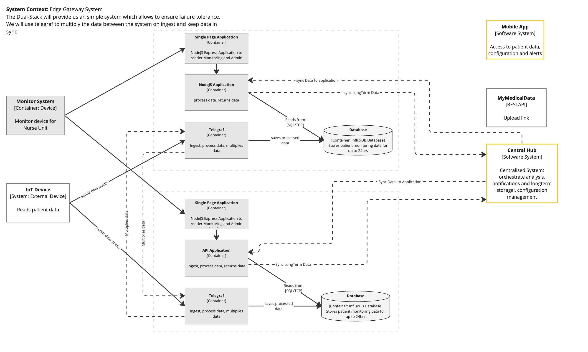
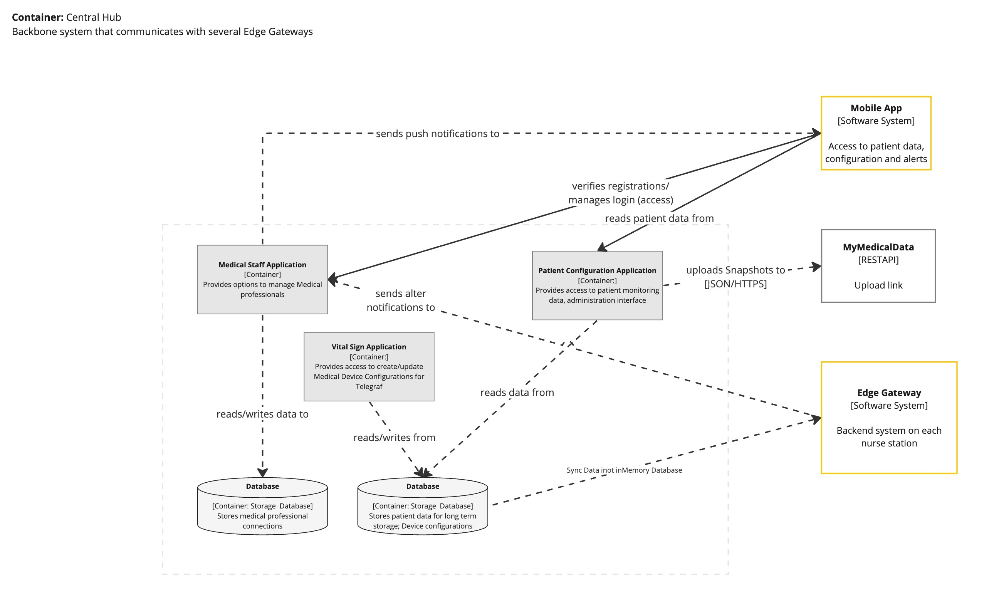
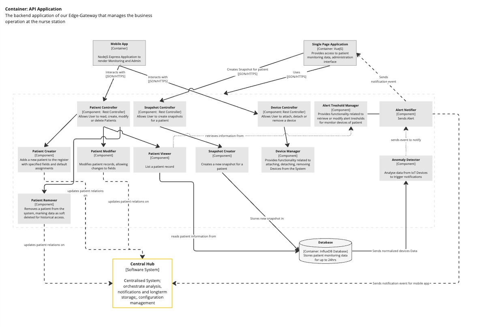
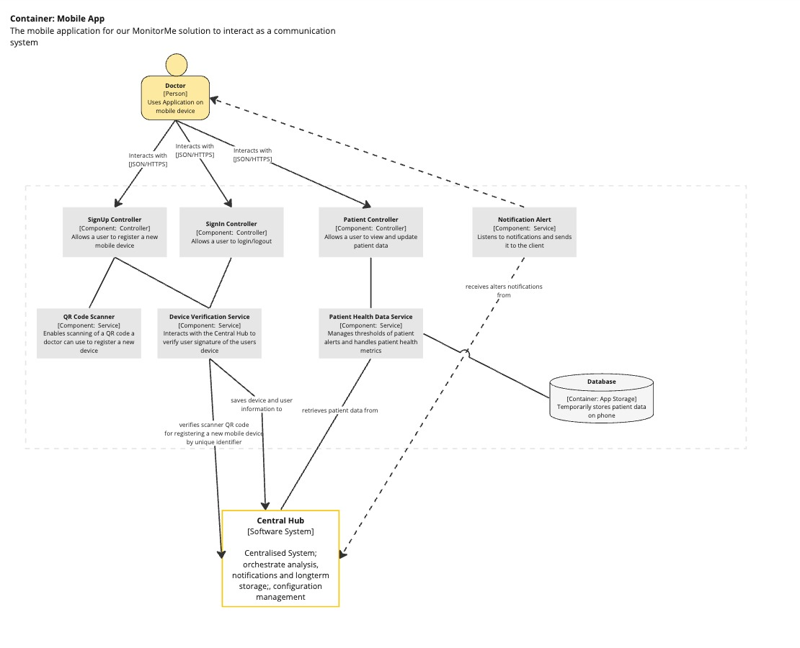

# Conceptual System Design

The following show the conceptual design for the MonitorMe system.  
More information about C4 modelling can be found at [c4model.com](https://c4model.com/).

We decided to go with this kind of architecture visualization.

[ADR 01 - Diagram Technique](../ADRs/01-DiagramTechnique.md)

### C4 Model Key

### C1 - MonitorMe Context Diagram

The Context diagram shows how the MonitorMe system interacts with people and systems outside of it.

Three types of users have been identified:
- (Lead) Nurse,
- Doctor
- Patient
- Administrator. *(TODO to include)*

These are further defined in Actors, Actions & Significant Scenarios, with definitions in the Glossary.

### C2 - Edge Gateway Container Diagram

This diagram describes the architecture of our Edge-Gateway (EGW).  
The EGW gets installed within each nurse room inside a Hospital. It is the communication receiver and processor for each Vital Sign device of a patient.

For being able to handle partial outages we made this container redundant by using multiple of those containers per nurse station.

### C2 - Central Hub Container Diagram

The centralized Central Hub, located in each Hospital is responsible for up to 500 patients.
This system will be set up for handling outages and redundancy

### C3 - API Application Diagram

The API application is the heart of each nurse room. It houses the overall functionality to process and interact with data.

### C3 - Mobile Application Diagram

The mobile application is the information system for a doctor.  
S(he) can check the current health metrics for patients responsible and adjust individual thresholds for notifications

---

[> Home](../README.md)    [> Solution](README.md)
[< Prev](ArchitecturePattern.md)  |  [Next >](OverallSystem.md)

Todos:

- [ ] Create extended diagrams (C2/C3)
  - [ ] System Hub
  - [ ] Telegraf
  - [ ] Medical Staff Application
  - [ ] Vital Sign Application
  - [ ] Patient Configuration Application
- [ ] Layout redundancy in Central Hub
- [ ] Provide visual options for App/Monitor