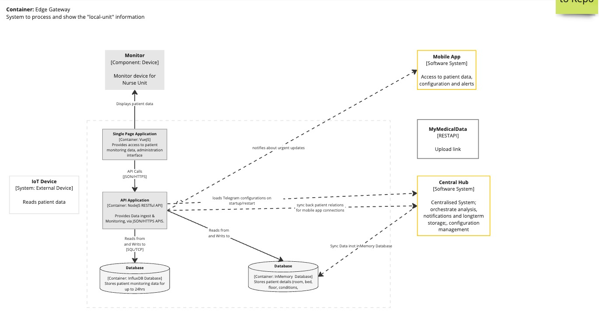
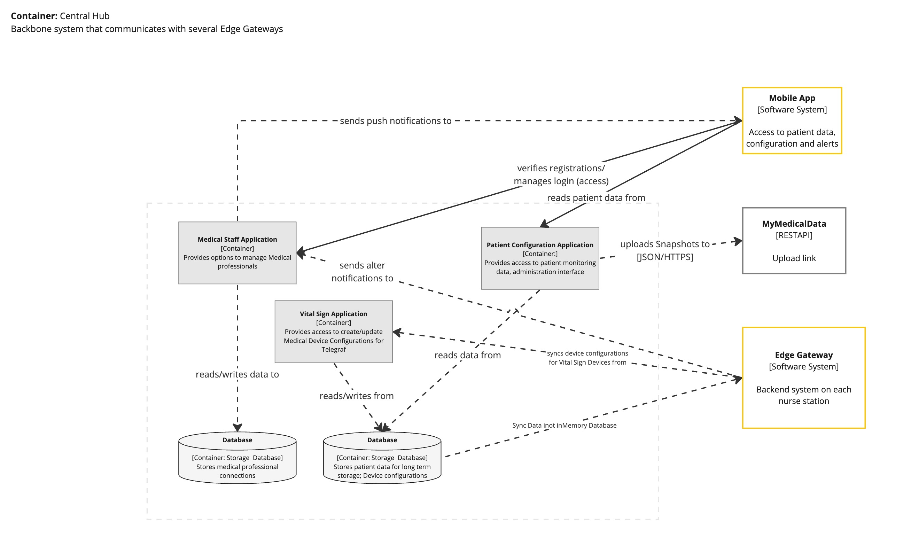

# Conceptual System Design

The following show the conceptual design for the MonitorMe system.  
More information about C4 modelling can be found at [c4model.com](https://c4model.com/).

We decided to go with this kind of architecture visualization.

[ADR 01 - Diagram Technique](../ADRs/01-DiagramTechnique.md)

### C4 Model Key

### C1 - MonitorMe Context Diagram

The Context diagram shows how the MonitorMe system interacts with people and systems outside of it.

Three types of users have been identified:
- (Lead) Nurse,
- Doctor
- Patient
- Administrator. *(TODO to include)*

These are further defined in Actors, Actions & Significant Scenarios, with definitions in the Glossary.

### C2 - Edge Gateway Container Diagram

This diagram describes the architecture of our Edge-Gateway (EGW).  
The EGW gets installed within each nurse room inside a Hospital. It is the communication receiver and processor for each Vital Sign device of a patient.

For being able to handle partial outages we made this container redundant by using multiple of those containers per nurse station.

### C2 - Central Hub Container Diagram

The centralized Central Hub, located in each Hospital is responsible for up to 500 patients.
This system will be set up for handling outages and redundancy

### C3 - API Application Diagram

The API application is the heart of each nurse room. It houses the overall functionality to process and interact with data.

### C3 - Mobile Application Diagram

The mobile application is the information system for a doctor.  
S(he) can check the current health metrics for patients responsible and adjust individual thresholds for notifications

---

## Architecture Characteristics

As described in our [Architecture Analysis](../Problem/ArchitectureAnalysis.md) our three most important characteristics for the system are:
1. Availability
2. Performance
3. Agility

With the following explanation we want to connect our conceptual design how it will fit into our analysis:

#### Availability

- The system itself is designed to be self-sufficient once it is up and running for the first time.
- We split the overall solution into mainly two parts: Edge-Gateway and Central Hub, to make it fault-tolerant.
- The general option to be able to integrate additional components into the Central Hub such as a GSM module for sending notifications also via SMS will help ensuring that important information are always send to Medical Professionals.
- Each of the Edge-Gateway - which are physically located in each nurse station - do have a component for Anomaly detection of the Medical devices. This will ensure that always the correct data is send and that the integrity of the data can be trusted. A information will be displayed onto the Monitor in case of a failure at any device, any point in time to take immediate action by the medical professionals.  
- In addition to that we planned a redundant setup of at least 2 Edge-Gateways per station in case of a temporary outage from any of those.
- For longer lasting outages, or in case of a power supply outage, we'll equip each of our Software Systems - Central Hub and Edge Gateways - with a dedicated UPS (Uninterruptible Power Supply). 

#### Performance

- We accounted for different scenarios where either synchronous or asynchronous exchange of information is needed by utilising an Event-Driven Architecture for real-time information exchange and a Service Based approach for the overall communication between the Edge-Gateway and the Central Hub system.
- For processing the unstructured data fast and efficiently our system relies on Telegraf which requires a very minimal memory footprint for operation and is specifically designed for IoT systems.
- To ensure fast processing without the need for making additional requests or network calls, the data analysis happens on side at the Edge-Gateway to reduce latency as much as possible. Persistent storage at the Central Hub happens asynchronously, afterward on a regular basis.
- To also keep the memory footprint in favor of performance as small as possible, we suggest NodeJS which provides us additionally with Real-Time event processing capabilities.

#### Agility

- For reacting to industry changes, or fast iterations of the system we will make use of a general configuration of the Telegraf configuration by the System Administrator at the Central Hub. On every interruption or restart of the Edge-Gateway the latest configuration will be loaded in the background. This enables the system to easily add/exchange or discontinue the use of specific Monitoring Devices.
- We're using an Internet-of-Things (IoT) approach for the overall medical devices to make them easy to replace.
- As the internal Application inside each Edge-Gateway system is a simple REST API that can communicate to the visual component for powering the Device Monitor at the nurse station this can be easily transformed into a different technology stack when adapting the solution, e.g. oversees where other technologies are more frequently used, without any impact of the functionality of the system itself.
- For automated and streamlined integration and provisioning we're going for Ansible to deploy the system.
- Our Edge-Gateway and Central Hub solution by definition is scalable and modular. Therefor also a capacity increase of patients in a hospital is not an issue at all for the system.  

---

[> Home](../README.md)    [> Solution](README.md)
[< Prev](ArchitecturePattern.md)  |  [Next >](OverallSystem.md)

Todos:

- [ ] Create extended diagrams (C2/C3)
  - [ ] System Hub
  - [ ] Telegraf
  - [ ] Medical Staff Application
  - [ ] Vital Sign Application
  - [ ] Patient Configuration Application
- [ ] Layout redundancy in Central Hub
- [ ] Provide visual options for App/Monitor