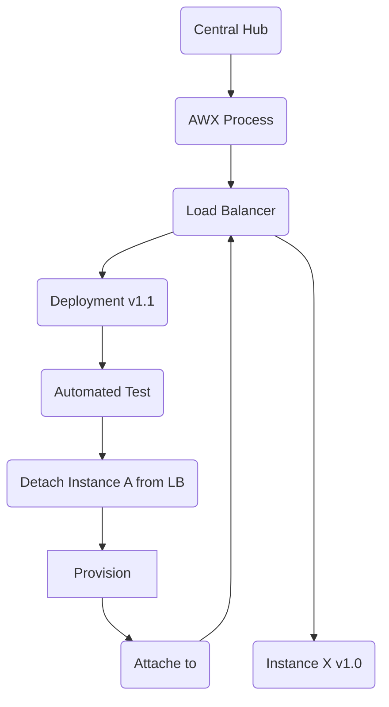

# Deployment process

### ADRs
- [Provisioning System](../ADRs/06-ProvisioningService.md)
- [Deployment System](../ADRs/05-DeployementSystem.md)

Simplified Flowchart

### Central Hub

Centralized instance which orchestrates processes

### Load Balancer

Edge Gateway Load balancer, manages the connection of the Edge Gateway instances.

### AWX Process

AWX process manager who orchestrates the deployment process across the instance groups.

When the deployment is started the AWX process connects to the Edge Gateway and executes the different actions. 

 

#### Deployment v1.1

AWX process makes new version available on the existing system.

#### Automated Test

AWX process runs required Integration-Test on the deployed instance. 

#### Detach Instance A from LB

AWX process initially detaches a instance before enabling new application version

#### Provision

AWX process apply application provision, stopping current version gracefully and restarts with new Version 1.1

#### Attach to

AWX process attaches the instance again to the Load Balancer 