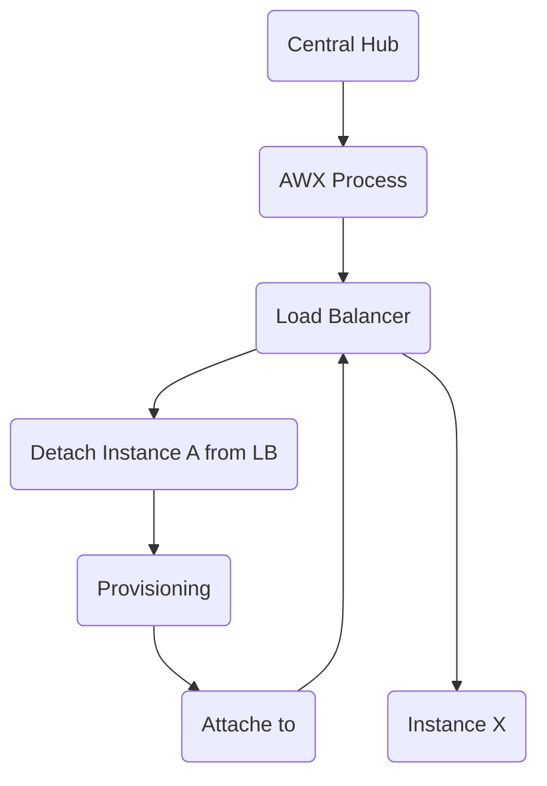

# Provisioning process

### ADRs
- [Provisioning System](../ADRs/06-ProvisioningService.md)

Simplified Flowchart

### Central Hub

Centralized instance which orchestrates processes

### Load Balancer

Edge Gateway Load balancer, manages the connection of the Edge Gateway instances.

### AWX Process

AWX process manager who orchestrates the provisioning process across the instance groups.

When the provisioning is started the AWX process connects to the Edge Gateway and executes the different actions. 

#### Provisioning

AWX process provisions changes to the existing system.

#### Detach Instance A from LB

AWX process initially detaches a instance before provisioning new application state.

#### Attach to

AWX process attaches the instance again to the Load Balancer 