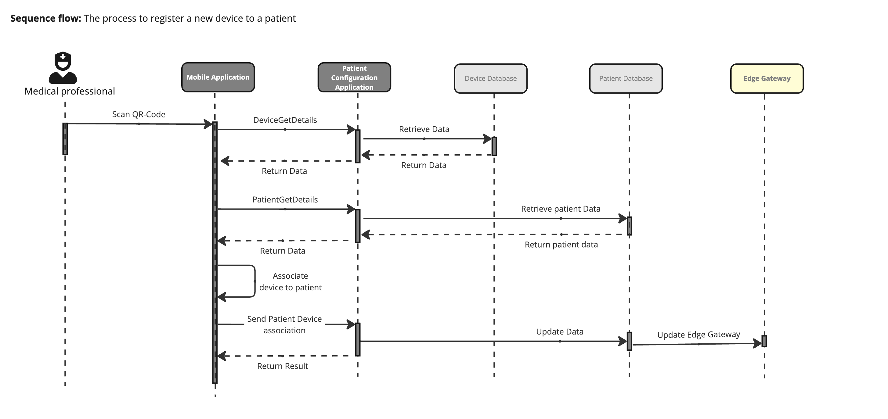

# QR Device to patient register flow

**Edge Gateway** is the [EGW system](EdgeGatewaylSystem.md)
- [Update Edge Gateway](../ADRs/11-CacheStrategy.md)
- [Database](../ADRs/12-Database.md) for Device and Patient Data

---

[> Home](../README.md)    [> Solution](README.md)
[< Prev](HardwareConnectivity.md)  |  [Next >](../ADRs/README.md)